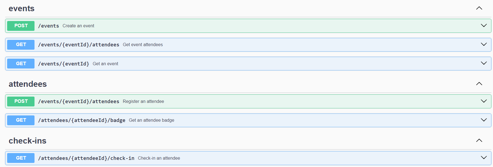

# pass.in

O pass.in é uma aplicação de **gestão de participantes em eventos presenciais**. 
A ferramenta permite que o organizador cadastre um evento e abra uma página pública de inscrição.
Os participantes inscritos podem emitir uma credencial para check-in no dia do evento.
O sistema fará um scan da credencial do participante para permitir a entrada no evento.

## Para iniciar o projeto localmente:
- Clone o repositório
- No terminal digite: "npm install"
- Crie as variáveis de ambiente como as que estão no arquivo de exemplo ".env.example"
- No terminal digite: "npm run dev"
- Pronto, o projeto estará rodando em http://localhost:2222/
- No terminal digite: "npm run db:studio" para visualizar as tabelas e dados no banco de dados
- No terminal digite: "npm run db:migrate" para fazer uma nova migrate no banco de dados, caso faça alguma alteração

## Documentação da API (Swagger)
Para a documentação da API (rotas), acesse o link: http://localhost:2222/docs

## Requisitos

### Requisitos funcionais

- [X] O organizador deve poder cadastrar um novo evento;
- [X] O organizador deve poder visualizar dados de um evento;
- [X] O organizador deve poder visualizar a lista de participantes de um evento; 
- [X] O participante deve poder se inscrever em um evento;
- [X] O participante deve poder visualizar seu crachá de inscrição;
- [X] O participante deve poder realizar check-in no evento;

### Regras de negócio

- [X] O participante só pode se inscrever em um evento uma única vez;
- [X] O participante só pode se inscrever em eventos com vagas disponíveis;
- [X] O participante só pode realizar check-in em um evento uma única vez;

## Banco de dados

Nessa aplicação vamos utilizar banco de dados relacional (SQL). Para ambiente de desenvolvimento seguiremos com o SQLite pela facilidade do ambiente.

### Diagrama ERD


### Rotas da aplicação



### Estrutura do banco (SQL)

```sql
-- CreateTable
CREATE TABLE "events" (
    "id" TEXT NOT NULL PRIMARY KEY,
    "title" TEXT NOT NULL,
    "details" TEXT,
    "slug" TEXT NOT NULL,
    "maximum_attendees" INTEGER
);

-- CreateTable
CREATE TABLE "attendees" (
    "id" INTEGER NOT NULL PRIMARY KEY AUTOINCREMENT,
    "name" TEXT NOT NULL,
    "email" TEXT NOT NULL,
    "event_id" TEXT NOT NULL,
    "created_at" DATETIME NOT NULL DEFAULT CURRENT_TIMESTAMP,
    CONSTRAINT "attendees_event_id_fkey" FOREIGN KEY ("event_id") REFERENCES "events" ("id") ON DELETE RESTRICT ON UPDATE CASCADE
);

-- CreateTable
CREATE TABLE "check_ins" (
    "id" INTEGER NOT NULL PRIMARY KEY AUTOINCREMENT,
    "created_at" DATETIME NOT NULL DEFAULT CURRENT_TIMESTAMP,
    "attendeeId" INTEGER NOT NULL,
    CONSTRAINT "check_ins_attendeeId_fkey" FOREIGN KEY ("attendeeId") REFERENCES "attendees" ("id") ON DELETE RESTRICT ON UPDATE CASCADE
);

-- CreateIndex
CREATE UNIQUE INDEX "events_slug_key" ON "events"("slug");

-- CreateIndex
CREATE UNIQUE INDEX "attendees_event_id_email_key" ON "attendees"("event_id", "email");

-- CreateIndex
CREATE UNIQUE INDEX "check_ins_attendeeId_key" ON "check_ins"("attendeeId");
```
